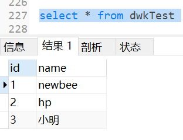
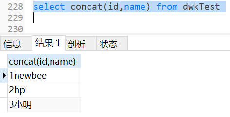

# 常用函数详解
#### 1、CONCAT()

    SELECT CONCAT(A,B) FROM TABLE 用于合并两个字段

 

#### 2、AVG()

    SELECT AVG(A) FROM TABLE  用于求字段的平均值，会忽略null行

#### 3、COUNT()

    SELECT COUNT(1) FROM TABLE  用于返回某列的行数，1和*的时候返回全表行数

#### 4、MAX()

    SELECT MAX() FROM TABLE  用于返回某列中最大的值

#### 5、MIN()

    SELECT MIN() FROM TABLE  用于返回某列中最小的值

#### 6、SUM()

    SELECT SUM() FROM TABLE  用于返回某列之和

#### 7、LEFT()

    LEFT(STR,LENGTH)  用于处理文本，截取STR左边长度为LENGTH的字符串

#### 8、RIGHT()

    RIGHT(STR,LENGTH)  用于处理文本，截取STR右边长度为LENGTH的字符串

#### 9、LOWER()

    LOWER(STR)  用于处理文本，将STR转换成小写字符

#### 10、UPPER()

    UPPER(STR)  用于处理文本，将STR转换成大写字符

#### 11、LTRIM()

    LTRIM(STR)  用于处理文本，去除STR第一个字符左边的所有空格

#### 12、RIRIM()

    RIRIM(STR)  用于处理文本，去除STR右边所有空格，即最后一个字符后的所有空格

#### 13、LENGTH()

    LENGTH(STR)  用于获取STR的长度

#### 14、SOUNDEX()

    SOUNDEX(STR)  用于处理文本，将字符串STR转换为描述其语音表示的字母数字模式

#### 15、AddDate()

    AddDate('2022-04-28',10)  用于处理日期，示例将得到2022-05-08

#### 16、AddTime()

    AddTime('2022-04-28 00:00:00',30)  用于处理时间，示例将得到2022-04-28 00:00:30
    添加的时间也可以用具体时间
    AddTime('2022-04-28 00:00:00','10:00:00') 将得到2022-04-28 10:00:00

#### 17、CurDate()

    CurDate() 用于返回当前日期，不包含时分秒

#### 18、CurTime()

    CurTime()  用于返回当前时间，只包含时分秒

#### 19、Date()

    Date('2022-04-28 10:10:10')  返回表达式中的日期，示例将得到2022-04-28

#### 20、DateDiff()

    DateDiff('2022-04-28','2022-05-28')  用于计算两个日期间隔多少天，示例将返回 -30

#### 21、Date_Add()

    语法格式：DATE_ADD(date,INTERVAL expr type);
    data为合法的日期表达式
    INTERVAL固定关键字
    expr表示数值
    type表示单位
    Date_Add('2022-04-28',INTERVAL 2 DAY)  高度灵活的日期计算函数，示例将得到2022-04-30
其中type可以为以下类型

| TYPE | 含义 |
| :--- | :--- |
| MICROSECOND | 微秒 |
| SECOND | 秒 |
| MINUTE | 分 |
| HOUR | 时 |
| DAY | 日 |
| WEEK | 周 |
| MONTH | 月 |
| QUARTER | 半年 |
| YEAR | 年 |
| SECOND_MICROSECOND | 毫妙 |
| MINUTE_MICROSECOND |  |
| MINUTE_SECOND |  |
| HOUR_MICROSECOND |  |
| HOUR_SECOND |  |
| HOUR_MINUTE |  |
| DAY_MICROSECOND |  |
| DAY_SECOND |  |
| DAY_MINUTE |  |
| DAY_HOUR |  |
| YEAR_MONTH |  |

#### 22、Date_Format()

    语法格式：DATE_FORMAT(date,format)
    用于返回一个格式化的日期或时间串
    date为合法的日期时间字符串
    format为转化表达式
    DATE_FORMAT('2022-04-28','%D') 将返回 28th
其中format可以为以下格式

| format | 含义 |
| :--- | :--- |
| %a | 	缩写星期名 |
| %b | 	缩写月名 |
| %c | 	月，数值 |
| %D | 	带有英文前缀的月中的天 |
| %d | 	月的天，数值(00-31) |
| %e | 	月的天，数值(0-31) |
| %f | 	微秒 |
| %H | 	小时 (00-23) |
| %h | 	小时 (01-12) |
| %I | 	小时 (01-12) |
| %i | 	分钟，数值(00-59) |
| %j | 	年的天 (001-366) |
| %k | 	小时 (0-23) |
| %l | 	小时 (1-12) |
| %M | 	月名 |
| %m | 	月，数值(00-12) |
| %p | 	AM 或 PM |
| %r | 	时间，12-小时（hh:mm:ss AM 或 PM） |
| %S | 	秒(00-59) |
| %s | 	秒(00-59) |
| %T | 	时间, 24-小时 (hh:mm:ss) |
| %U | 	周 (00-53) 星期日是一周的第一天 |
| %u | 	周 (00-53) 星期一是一周的第一天 |
| %V | 	周 (01-53) 星期日是一周的第一天，与 %X 使用 |
| %v | 	周 (01-53) 星期一是一周的第一天，与 %x 使用 |
| %W | 	星期名 |
| %w | 	周的天 （0=星期日, 6=星期六） |
| %X | 	年，其中的星期日是周的第一天，4 位，与 %V 使用 |
| %x | 	年，其中的星期一是周的第一天，4 位，与 %v 使用 |
| %Y | 	年，4 位 |
| %y | 	年，2 位 |

#### 22、Day()

    Day('2022-04-28')  用于返回一个日期的天数，示例将返回28

#### 23、DayOfWeek()

    DayOfWeek('2022-04-28')  返回一个日期对应的星期几，周天为1，示例04-28为星期四，返回5

#### 24、Hour()

    Hour('10:11:12')  用于返回时间的小时部分，示例将返回10

#### 25、Minute()

    Minute('10:11:12')  用于返回时间的分钟部分，示例将返回11

#### 26、Second()

    Second('10:11:12')  用于返回时间的

#### 27、Year()

    Year('2022-04-28')  用于返回日期的年部分，示例将返回2022

#### 28、Month()

    Month('2022-04-28')  用于返回日期的月部分，示例将返回4

#### 29、Now()

    Now()  用于返回当前日期时间，格式为yyyy-MM-dd HH:mm:ss

#### 30、Time()

    Time('2022-04-28 10:11:12')  用于返回日期的时间部分，示例将返回10:11:12

#### 31、FROM_UNIXTIME()
    FROM_UNIXTIME('1652371200')  用于将时间戳转换成日期，示例将返回2022-05-13 00:00:00.000000

#### 32、UNIX_TIMESTAMP()
    UNIX_TIMESTAMP('2022-05-13') 用于将日期转换成时间戳，示例将返回1652371200

#### 33、数值处理
| 函数 |	说明|
| :--- | :--- |
| SIN() | 正弦 |
|COS() | 余弦|
|TAN() | 正切|
|ABS() | 绝对值|
|SQRT() | 平方根|
|MOD() | 余数|
|EXP() | 指数|
|PI() | 圆周率|
|RAND() | 随机数|
