# Netty基础总结

## 1、IO类型及说明

| 类型 | 含义         | 说明                                                                                                                             | 使用场景                                                                 |
| ---- | ------------ | -------------------------------------------------------------------------------------------------------------------------------- | ------------------------------------------------------------------------ |
| BIO  | 同步并阻塞IO | 服务器实现模式为一个连接对应一个线程，<br />客户端连接过多会严重影响性能                                                         | 连接数少且固定的架构，对服务器资源要求高，并发局限于应用中，如数据库连接 |
| NIO  | 同步非阻塞IO | 服务器实现模式为一个线程处理多个连接，<br />即客户端发送的连接请求都会注册到多路复用上；<br />多路复用器轮询到有IO请求就进行处理 | 连接数多且连接较短的架构，如聊天、弹幕、服务器间通讯                     |
| AIO  | 异步非阻塞IO | 无论是客户端的连接请求还是读写请求都会异步执行；                                                                                 | 连接数较多且连接较长的架构，充分调用操作系统参与                         |

## 2、BIO基本介绍

1、传统的Java io编程、其相关的类和接口在java.io包下

2、同步阻塞。服务器实现模式为一个连接一个线程，即客户端有连接请求时服务器端就要启动一个线程进行处理，如果这个连接不做任何事情会造成不必要的线程开销

3、执行流程：

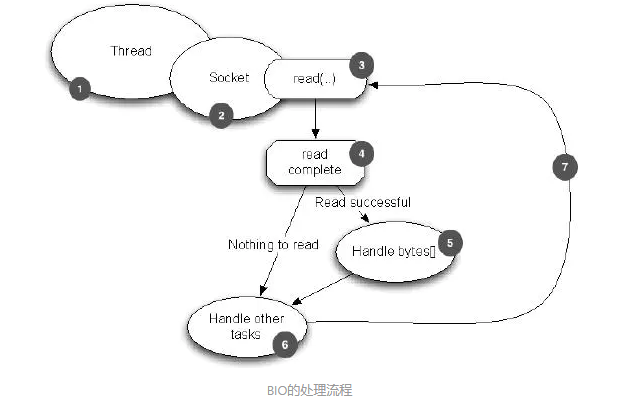

    服务器端启动一个ServerSocket

    客户端启动Socket对服务器进行通信，默认情况下服务器端需要对每个客户端建立一个线程与之通讯

    客户端发出请求后，先咨询服务器是否有线程响应，如果没有则会等待或者被拒绝  如果有响应，客户端会等待请求结束后才继续执行

4、模型：

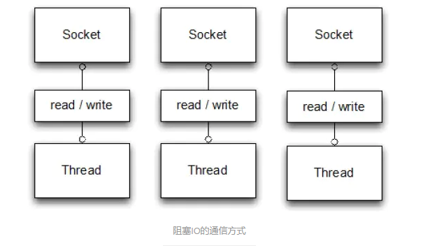

## 3、NIO基本介绍

1、原生jdk io上的一个改进 同步非阻塞！

2、三大核心组件:

| 类型     | 含义   | 理解                                  |                                   |
| -------- | ------ | ------------------------------------- | --------------------------------- |
| Channel  | 通道   | 一个Channel就代表一个连接             | 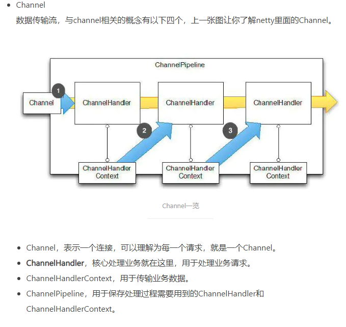 |
| Buffer   | 缓冲区 | 用于临时存储的一块内存                |     |
| Selector | 选择器 | 对Channel的一个管理器，监听通道的事件 |                                   |

3、模型：


4、特性：

&nbsp;&nbsp;&nbsp;&nbsp;a.  面向缓冲，数据读取到一个它稍后处理的缓冲区，需要时可以在缓冲区中前后移动，这就增加了处理过程中的灵活性，可以提供非阻塞的高伸缩性网格；

&nbsp;&nbsp;&nbsp;&nbsp;b.  非阻塞；

&nbsp;&nbsp;&nbsp;&nbsp;c.  通过选择器来模拟多线程；

## 4、NIO和BIO区别

1、BIO以流的方式处理数据，NIO以块的方式处理数据，块的效率 > 流的效率

2、BIO阻塞   NIO非阻塞

3、BIO基于字节流和字符流进行操作；NIO基于Channel(通道)和Buffer(缓冲区)进行操作，数据总是从通道内读取到缓冲区或者从缓冲区写入到通道。

4、BIO监听一个连接需要一个线程，NIO中一个线程可以监听多个连接

## 5、NIO三大核心原理

1、每个channel都对应一个buffer

2、selector对应一个线程，一个线程对应多个channel

3、selector选择哪个channel是由事件决定的

4、数据的读写都是操作的buffer

5、BIO中要么是输入流要么是输出流，NIO中的Buffer可读也可写

## 6、Buffer和Channel的注意细节

1、ByteBuffer支持类型化的put和get，put放入的是什么数据类型  get就应该使用相应的类型来取出

2、可以改变Buffer的可读性

3、NIO提供MappedByteBuffer，可以直接让文件在内存中修改(堆外内存)，相当于直接在操作系统上操作文件而不用再拷贝一份进行操作，效率快

4、读写操作可以通过一个Buffer来操作，NIO还支持通过多个Buffer操作即Buffer数组形式操作

## 7、NIO部分demo代码

```java
package com.dwk.nio;

import java.io.*;
import java.net.InetSocketAddress;
import java.net.ServerSocket;
import java.nio.ByteBuffer;
import java.nio.IntBuffer;
import java.nio.MappedByteBuffer;
import java.nio.channels.*;
import java.util.ArrayList;
import java.util.Arrays;
import java.util.Iterator;
import java.util.Set;

/**
 * nio 案例实现
 */
public class NioDemo {

    public static void main(String[] args) {
        //buffer的基本使用
        //intBuffTest(5);

        //channel的基本使用
        //channelTest();

        //文件拷贝
        //transferFormTest("","");

        //buffer的存取
        //bufferPutGet();

        //buffer的只读
        //readOnlyBuffer();

        //使用byteBuffer数组读取进行数据交互
        bufferArray();
    }

    public static void intBuffTest(int capacity) {
        //创建一个容量大小为capacity的buff
        IntBuffer allocate = IntBuffer.allocate(capacity);
        for (int i = 0; i < capacity; i++) {
            allocate.put(i * 2);
        }
        //将buffer切换，读写切换  处理buffer内的标记
        allocate.flip();
        //指定开始读取的位置
        //allocate.position(1);
        //指定结束读取的位置
        //allocate.limit(2);
        while (allocate.hasRemaining()){
            System.out.println(allocate.get());
        }
    }

    public static void channelTest(){
        //DatagramChannel  用于UDP数据的读写，ServerSocketChannel/SocketChannel用于TCP的数据读写

        //文件写通道
        fileChannelWriteTest();
        //文件读通道
        fileChannelReadTest();
        //使用一个通道完成文件的读写 - 文件拷贝
        fileChannelWriteAndReadTest();

    }

    /**
     * 文件写入
     */
    public static void fileChannelWriteTest(){
        FileOutputStream fileOutputStream = null;
        FileChannel fileChannel = null;
        ByteBuffer byteBuffer;
        try {
            String str = "fileChannelTest";
            fileOutputStream = new FileOutputStream("C:\\duwk\\code\\myself\\frame-master\\netty\\src\\main\\resources\\file\\FileChannel.txt");
            //获取通道
            fileChannel = fileOutputStream.getChannel();
            //创建缓冲区
            byteBuffer = ByteBuffer.allocate(1024);
            //写入缓冲区
            byteBuffer.put(str.getBytes("UTF-8"));
            //缓冲区索引重置
            byteBuffer.flip();
            //缓冲区数据写入通道
            fileChannel.write(byteBuffer);
        } catch (FileNotFoundException e) {
            throw new RuntimeException(e);
        } catch (UnsupportedEncodingException e) {
            throw new RuntimeException(e);
        } catch (IOException e) {
            throw new RuntimeException(e);
        }finally {
            try {
                fileOutputStream.close();
                fileChannel.close();
            } catch (IOException e) {
                throw new RuntimeException(e);
            }
        }
    }

    /**
     * 文件读取
     */
    public static void fileChannelReadTest(){
        FileInputStream fileInputStream = null;
        ByteBuffer byteBuffer = null;
        FileChannel channel = null;
        try {
            String filePath = "C:\\duwk\\code\\myself\\frame-master\\netty\\src\\main\\resources\\file\\FileChannel.txt";
            File file = new File(filePath);
            fileInputStream = new FileInputStream(file);
            //通道读取文件
            channel = fileInputStream.getChannel();
            //缓冲区读取通道
            byteBuffer = ByteBuffer.allocate((int) file.length());
            channel.read(byteBuffer);
            byteBuffer.flip();
            //缓冲区数据输出
            System.out.println(new String(byteBuffer.array(),"UTF-8"));
        } catch (FileNotFoundException e) {
            throw new RuntimeException(e);
        } catch (IOException e) {
            throw new RuntimeException(e);
        }finally {
            try {
                fileInputStream.close();
                channel.close();
            } catch (IOException e) {
                throw new RuntimeException(e);
            }
        }
    }

    /**
     * 文件拷贝
     */
    public static void fileChannelWriteAndReadTest(){
        FileOutputStream outputStream = null;
        FileInputStream inputStream = null;
        ByteBuffer byteBuffer = null;
        try {
            String fileName = "C:\\duwk\\code\\myself\\frame-master\\netty\\src\\main\\resources\\file\\FileChannel.txt";
            String targetFileName = "C:\\duwk\\code\\myself\\frame-master\\netty\\src\\main\\resources\\file\\FileChannel副本.txt";
            File file = new File(fileName);
            File fileClone = new File(targetFileName);
            if (fileClone.exists()) {
                fileClone.delete();
                fileChannelWriteAndReadTest();
            }
            inputStream = new FileInputStream(file);
            //读取源文件流到通道
            FileChannel inChannel = inputStream.getChannel();
            //通道中的数据流写入到缓冲区
            byteBuffer = ByteBuffer.allocate(1024);
            inChannel.read(byteBuffer);
            byteBuffer.flip();
            //将缓冲区中的数据流写入到另一个通道
            outputStream = new FileOutputStream(fileClone);
            FileChannel outChannel = outputStream.getChannel();
            outChannel.write(byteBuffer);
        }catch (Exception e){
            e.printStackTrace();
        }finally {
            try {
                outputStream.close();
                inputStream.close();
            } catch (IOException e) {
                throw new RuntimeException(e);
            }
        }

    }

    /**
     * buffer的类型存取  按顺序存取
     */
    public static void bufferPutGet(){
        ByteBuffer byteBuffer = ByteBuffer.allocate(64);

        byteBuffer.putInt(1);
        byteBuffer.putLong(1L);
        byteBuffer.putChar('A');
        byteBuffer.putShort((short) 1);

        byteBuffer.flip();

        //正常取出
        int anInt = byteBuffer.getInt();
        long aLong = byteBuffer.getLong();
        char aChar = byteBuffer.getChar();
        short aShort = byteBuffer.getShort();

        System.out.println(anInt);
        System.out.println(aLong);
        System.out.println(aChar);
        System.out.println(aShort);

        System.out.println("======================");

        //乱序取出  有异常
        short bShort = byteBuffer.getShort();
        char bChar = byteBuffer.getChar();
        long bLong = byteBuffer.getLong();
        int bnInt = byteBuffer.getInt();

        System.out.println(bnInt);
        System.out.println(bLong);
        System.out.println(bChar);
        System.out.println(bShort);
    }

    /**
     * 设置buffer只读
     */
    public static void readOnlyBuffer(){
        ByteBuffer byteBuffer = ByteBuffer.allocate(64);
        byteBuffer.putInt(1);
        //设置只读
        byteBuffer.asReadOnlyBuffer();
        int anInt = byteBuffer.getInt();
        System.out.println("buffer只读 ==>" + anInt);
    }

    /**
     * 使用通道的transferFrom方法拷贝文件
     * @param sourcePath 源文件路径
     * @param targetPath 目标文件路径
     */
    public static void transferFormTest(String sourcePath,String targetPath){
        FileInputStream inputStream = null;
        FileOutputStream outputStream = null;
        FileChannel inputStreamChannel = null;
        FileChannel outputStreamChannel = null;
        try {
            //创建文件流
            inputStream = new FileInputStream(sourcePath);
            outputStream = new FileOutputStream(targetPath);
            //信道
            inputStreamChannel = inputStream.getChannel();
            outputStreamChannel = outputStream.getChannel();
            //拷贝  参数：src = 源通道   position = 文件内开始转移的位置，必须是非负数   count = 最大的转换字节数，必须非负数
            outputStreamChannel.transferFrom(inputStreamChannel,0,inputStreamChannel.size());

        } catch (FileNotFoundException e) {
            throw new RuntimeException(e);
        } catch (IOException e) {
            throw new RuntimeException(e);
        }finally {
            try {
                //关闭通道和流
                inputStreamChannel.close();
                outputStreamChannel.close();
                inputStream.close();
                outputStream.close();
            } catch (IOException e) {
                throw new RuntimeException(e);
            }
        }
    }

    /**
     * 零拷贝
     * mappedByteBuffer - 可以让文件直接在内存(堆外内存)中进行修改，操作系统不必拷贝一次  NIO同步到文件
     * 相当于直接操作源文件，性能高，但是不安全
     */
    public static void mappedByteBufferTest(){
        RandomAccessFile randomAccessFile = null;
        try {
            //name : 文件名  mode：模式（r，rw，rws，rwd）
            randomAccessFile = new RandomAccessFile("", "");
            //获取通道
            FileChannel channel = randomAccessFile.getChannel();
            //MapMode mode   模式, long position  可以直接修改的起始位置, long size   映射到内存的大小(不是索引位置)即文件的多少个字节映射到内存
            MappedByteBuffer map = channel.map(FileChannel.MapMode.READ_WRITE, 0, 5);
            //修改文件
            map.put(0,(byte) 'A');
            map.put(10,(byte) 'B');
        } catch (FileNotFoundException e) {
            throw new RuntimeException(e);
        } catch (IOException e) {
            throw new RuntimeException(e);
        }finally {
            try {
                randomAccessFile.close();
            } catch (IOException e) {
                throw new RuntimeException(e);
            }
        }
    }

    /**
     * buffer的分散和聚集
     * buffer数组操作   Scattering:将数据写入到buffer时可以采用buffer数组依次写入  Gathering：从buffer读取数据时依次读取buffer数组
     */
    public static void bufferArray(){
        //服务端通道
        ServerSocketChannel serverSocketChannel = null;
        //客户端通道
        SocketChannel socketChannel = null;
        try {
            //创建服务端通道
            serverSocketChannel = ServerSocketChannel.open();
            //指定端口
            InetSocketAddress inetSocketAddress = new InetSocketAddress(6666);
            //绑定端口并启动
            serverSocketChannel.socket().bind(inetSocketAddress);
            //服务端的buffer数组
            ByteBuffer[] byteBuffers = new ByteBuffer[2];
            //初始化buffer大小
            byteBuffers[0] = ByteBuffer.allocate(5);
            byteBuffers[1] = ByteBuffer.allocate(3);
            //等待客户端连接
            socketChannel = serverSocketChannel.accept();
            //每次从客户端通道读取的字节数
            int countByte = 8;
            //获取客户端发送的数据,,循环读取
            while (true){
                //统计读取的字节数
                int byteRead = 0;
                while (byteRead < countByte){
                    //从客户端通道读取字节到buffer数组
                    long read = socketChannel.read(byteBuffers);
                    byteRead += read;
                    System.out.println("累计读取的字节:" + byteRead);
                    Arrays.stream(byteBuffers).map(buffer -> "position = " + buffer.position() + "    limit = " + buffer.limit()).forEach(System.out::println);
                }
                //将所有的buffer反转
                Arrays.stream(byteBuffers).forEach(buffer -> {buffer.flip();});
                //将数据读出显示到客户端
                long byteWrite = 0;
                while (byteWrite < countByte){
                    long writeByte = socketChannel.write(byteBuffers);
                    byteWrite += writeByte;
                }
                //将所有的buffer清除
                Arrays.stream(byteBuffers).forEach(buffer -> {buffer.clear();});

                System.out.println("byteRead : " + byteRead + "  byteWrite : " + byteWrite + "  byteCount : " + countByte);
            }
        } catch (IOException e) {
            throw new RuntimeException(e);
        }finally {
            try {
                serverSocketChannel.close();
                socketChannel.close();
            } catch (IOException e) {
                throw new RuntimeException(e);
            }
        }
    }

}

```

## 8、Selector选择器基本介绍

1、Java的NIO用非阻塞的IO方式。可以用一个线程处理多个客户端的连接，就会使用到Selector(选择器)

2、Selector能检测多个通道上是否有事件发生(多个Channel以事件的方式可以注册到同一个Selector)，如果有事件发生，便获取事件然后针对每个事件进行相应的处理。这样就可以只用一个单线程去管理多个通道，也就是管理多个连接和请求。

3、只用在真正有读写事件发生时，才会进行读写，减少系统开销，不用为每个连接都创建一个线程

4、避免了线程上下文切换的问题

5、Selector示意图和特点说明


## 9、NIO非阻塞网络编程原理分析

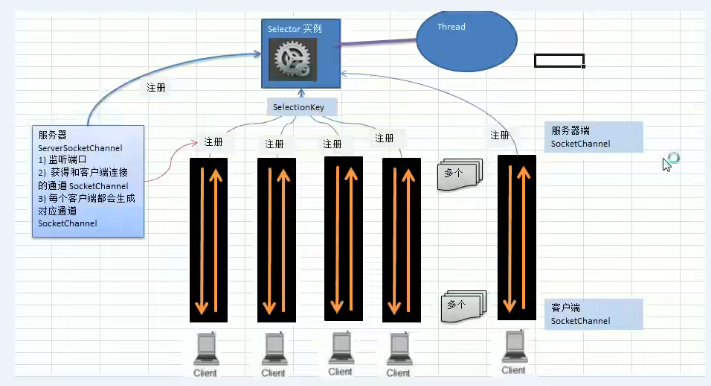

Selector、SelectorKey、ServerSocketChannel、SocketChannel之间的关系如图；

1、当客户端连接时，会通过ServerSocketChannel得到SocketChannel；

2、将SocketChannel注册到指定的Selector上，一个Selector上可以注册多个SocketChannel；

3、注册后返回一个SelectionKey会和该Selector关联(集合)；

4、Selector进行监听select方法，返回有事件发生的通道的个数；

5、进一步得到各个SelectionKey(有事件发生)；

6、再通过SelectionKey反向获取SocketChannel；

7、可以通过得到的SocketChannel完成业务处理；

8、demo代码：

```java
package com.dwk.netty;

import java.io.IOException;
import java.net.InetSocketAddress;
import java.nio.ByteBuffer;
import java.nio.channels.*;
import java.util.Set;

/**
 * netty  demo
 */
public class NettyDemo {

    public static void main(String[] args) {
        chatting();
    }

    /**
     * 非阻塞实现服务端和客户端之间通信
     */
    public static void chatting () {
        Thread thread = new Thread(() -> {
            serverTest();
        });
        Thread thread1 = new Thread(() -> {
            clientTest();
        });
        thread.start();
        //等待两秒启动客户端
        try {
            Thread.sleep(2000);
        } catch (InterruptedException e) {
            throw new RuntimeException(e);
        }
        thread1.start();
    }


    /**
     * 服务器端
     */
    public static void serverTest(){
        try {
            ServerSocketChannel serverSocketChannel = ServerSocketChannel.open();
            Selector selector = Selector.open();
            InetSocketAddress inetSocketAddress = new InetSocketAddress(6666);
            serverSocketChannel.socket().bind(inetSocketAddress);
            //设置非阻塞
            serverSocketChannel.configureBlocking(false);
            //服务端的socketChannel注册到selector 并设置监听事件为准备连接事件
            serverSocketChannel.register(selector, SelectionKey.OP_ACCEPT);
            //循环等待客户端连接
            while (true){
                //阻塞一秒后事件数量若为0则没有连接事件发生
                boolean nothing = selector.select(1000) == 0;
                if (nothing){
                    System.out.println("服务器等待了1秒，无连接");
                    continue;
                }
                //有事件发生,获取到事件的selectionKey集合
                Set<SelectionKey> selectionKeys = selector.selectedKeys();
                //通过selectionKey反向获取通道
                selectionKeys.forEach(selectionKey -> {
                    //判断事件类型
                    //客户端连接事件
                    boolean acceptable = selectionKey.isAcceptable();
                    //
                    boolean connectable = selectionKey.isConnectable();
                    //客户端写事件
                    boolean writable = selectionKey.isWritable();
                    //
                    boolean valid = selectionKey.isValid();
                    //客户端读事件
                    boolean readable = selectionKey.isReadable();

                    if (acceptable){
                        //处理连接事件
                        try {
                            //客户端连接事件，，给客户端生成一个非阻塞的SocketChannel
                            SocketChannel socketChannel = serverSocketChannel.accept();
                            socketChannel.configureBlocking(false);
                            //将socketChannel注册到selector,设置监听事件为准备读事件,并关联一个Buffer
                            socketChannel.register(selector,SelectionKey.OP_READ, ByteBuffer.allocate(1024));
                        } catch (IOException e) {
                            throw new RuntimeException(e);
                        }
                    }

                    if (readable){
                        try {
                            //处理读取事件
                            SocketChannel socketChannel = (SocketChannel) selectionKey.channel();
                            //获取channel关联的buffer
                            ByteBuffer buffer = (ByteBuffer) selectionKey.attachment();
                            socketChannel.read(buffer);
                            System.out.println("客户端发送的数据：" + new String(buffer.array()));
                        } catch (IOException e) {
                            throw new RuntimeException(e);
                        }
                    }

                    //移除集合中的selectionKey，防止重复操作
                    selectionKeys.remove(selectionKey);
                });
            }
        } catch (IOException e) {
            throw new RuntimeException(e);
        }
    }

    /**
     * 客户端
     */
    public static void clientTest(){
        String data = "我是数据！";
        try {
            SocketChannel socketChannel = SocketChannel.open();
            //设置非阻塞
            socketChannel.configureBlocking(false);
            //设置服务器端的ip和端口
            InetSocketAddress inetSocketAddress = new InetSocketAddress("127.0.0.1", 6666);
            //连接服务器
            boolean connect = socketChannel.connect(inetSocketAddress);
            if (!connect){
                System.out.println("客户端正在连接...");
                while (!socketChannel.finishConnect()){
                    //客户端还没有连接成功，可以先处理其他逻辑
                    System.out.println("客户端还没有连接成功，还在连接!");
                }
            }
            System.out.println("客户端连接成功！发送数据给服务端...");
            ByteBuffer byteBuffer = ByteBuffer.wrap(data.getBytes());
            int write = socketChannel.write(byteBuffer);
            if (write == data.getBytes().length){
                System.out.println("客户端数据发送完成！");
            }
        } catch (IOException e) {
            throw new RuntimeException(e);
        }
    }

}

```

## 10、ServerSocketChannel和SocketChannel

|      | ServerSocketChannel                           | SocketChannel                                                                                                             |
| ---- | --------------------------------------------- | ------------------------------------------------------------------------------------------------------------------------- |
| 作用 | 在服务器端监听新的客户端Socket连接，偏向连接  | 网络IO通道，具体负责读写操作，NIO把缓冲区的数据写入通道或者把通道内的数据读入缓冲区<br />偏向数据的读写、有分散和聚集操作 |
| 类图 | 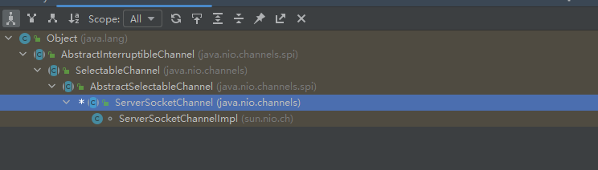 | 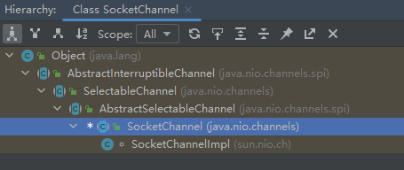                                                                                   |
| 方法 |  | 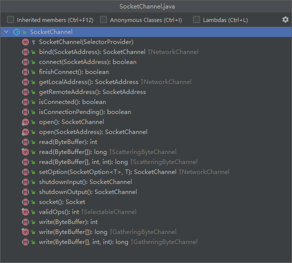                                                                                   |

## 11、零拷贝基本介绍

Java中常用的零拷贝有mmp(内存映射)和sendFile；零拷贝是网络编程中对性能优化的一个重要操作！

1、传统IO数据读写：

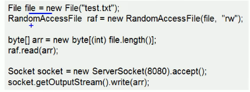

&nbsp;&nbsp;&nbsp;&nbsp;1、磁盘到内核 -> DMA拷贝（直接内存拷贝，不使用CPU）

&nbsp;&nbsp;&nbsp;&nbsp;2、内核到用户buffer -> CPU拷贝

&nbsp;&nbsp;&nbsp;&nbsp;3、用户buffer到socket buffer -> CPU拷贝

&nbsp;&nbsp;&nbsp;&nbsp;4、socket buffer到协议栈(协议引擎) -> DMA拷贝

**传统IO经过4次拷贝3次切换**

2、mmap优化(内存映射优化)

mmap通过内存映射，将文件映射到内核缓冲区，同时，用户空间可以共享内核空间数据；网络传输时可以减少内核空间到用户空间的拷贝次数

&nbsp;&nbsp;&nbsp;&nbsp;1、磁盘到内核 -> DMA拷贝（直接内存拷贝，不使用CPU）

&nbsp;&nbsp;&nbsp;&nbsp;2、用户空间共享内核

&nbsp;&nbsp;&nbsp;&nbsp;3、用户buffer到socket buffer -> CPU拷贝

&nbsp;&nbsp;&nbsp;&nbsp;4、socket buffer到协议栈(协议引擎) -> DMA拷贝

**3次拷贝3次切换**

3、sendFile优化

数据不用经过用户态，直接从内核缓冲区进入到Socket Buffer，同时，由于和用户态完全无关就减少了一次上下文切换

    Linux2.1版本

&nbsp;&nbsp;&nbsp;&nbsp;1、磁盘到内核 -> DMA拷贝（直接内存拷贝，不使用CPU）

&nbsp;&nbsp;&nbsp;&nbsp;2、内核到Socket Buffer -> CPU拷贝

&nbsp;&nbsp;&nbsp;&nbsp;3、Socket Buffer到协议栈(协议引擎) -> DMA拷贝

**3次拷贝2次切换**

    Linux2.4版本(真正意义上的零拷贝)

&nbsp;&nbsp;&nbsp;&nbsp;1、磁盘到内核 -> DMA拷贝（直接内存拷贝，不使用CPU）

&nbsp;&nbsp;&nbsp;&nbsp;2、内核到协议栈(协议引擎) -> DMA拷贝

**2次拷贝2次切换**

**零拷贝从操作系统看，指的是没有CPU拷贝，并不是不拷贝**

mmap和sendFile区别：

| 序号 | mmap                                 | sendFile                       |
| ---- | ------------------------------------ | ------------------------------ |
| 1    | 适合小数据量读写                     | 适合大文件传输                 |
| 2    | 4次上下文切换，3次数据拷贝           | 3次上下文切换，最少2次数据拷贝 |
| 3    | 必须从内核拷贝到Socket Channel缓冲区 | 可以利用DMA方式减少CPU拷贝     |

4、NIO零拷贝demo：

```java
class ZeroCopy {
    public static void main(String[] args) {
        //传统IO
        oldIO();
        //NIO 零拷贝
        newIO();
    }

    public static void oldIO(){
        Thread thread = new Thread(() -> {
            oldServer();
        });
        Thread thread1 = new Thread(() -> {
            oldClient();
        });
        thread.start();
        try {
            Thread.sleep(1000);
        } catch (InterruptedException e) {
            throw new RuntimeException(e);
        }
        thread1.start();
    }

    public static void newIO(){
        Thread thread = new Thread(() -> {
            newServer();
        });
        Thread thread1 = new Thread(() -> {
            newClkient();
        });
        thread.start();
        try {
            Thread.sleep(1000);
        } catch (InterruptedException e) {
            throw new RuntimeException(e);
        }
        thread1.start();
    }

    /**
     * 传统IO服务端
     */
    public static void oldServer(){
        try {
            ServerSocket server = new ServerSocket(6666);
            //等待客户端连接
            while (true){
                Socket client = server.accept();
                //获取连接的客户端的数据
                InputStream inputStream = client.getInputStream();
                DataInputStream dataInputStream = new DataInputStream(inputStream);
                //读取
                byte[] bytes = new byte[4096];
                while (true){
                    int read = dataInputStream.read(bytes, 0, bytes.length);
                    if (read == -1){
                        break;
                    }
                }
            }
        } catch (IOException e) {
            throw new RuntimeException(e);
        }
    }

    /**
     * 传统IO客户端
     */
    public static void oldClient(){
        Socket socket = null;
        FileInputStream inputStream = null;
        DataOutputStream dataOutputStream = null;
        try {
            socket = new Socket("127.0.0.1", 6666);
            //需要发送的文件
            String fileName = "C:\\duwk\\code\\myself\\frame-master\\netty\\src\\main\\resources\\file\\jdk1.8.0_51.zip";
            inputStream = new FileInputStream(fileName);
            //socket输出流
            dataOutputStream = new DataOutputStream(socket.getOutputStream());
            //文件存入byte数组并写入socket的输出流
            byte[] bytes = new byte[4096];
            long readCount;
            long total = 0;
            long start = System.currentTimeMillis();
            while ((readCount = inputStream.read(bytes)) >= 0){
                total += readCount;
                dataOutputStream.write(bytes);
            }
            long end = System.currentTimeMillis();
            System.out.println("传统IO方式=========总共传输字节：" + total +"耗时：" + (end - start));
        } catch (IOException e) {
            throw new RuntimeException(e);
        }finally {
            try {
                socket.close();
                inputStream.close();
                dataOutputStream.close();
            } catch (IOException e) {
                throw new RuntimeException(e);
            }
        }
    }

    /**
     * 零拷贝服务端
     */
    public static void newServer(){
        try {
            InetSocketAddress inetSocketAddress = new InetSocketAddress(9999);
            ServerSocketChannel serverSocketChannel = ServerSocketChannel.open();
            ServerSocket socket = serverSocketChannel.socket();
            socket.bind(inetSocketAddress);
            ByteBuffer byteBuffer = ByteBuffer.allocate(4096);
            while (true){
                //等待客户端连接
                SocketChannel socketChannel = serverSocketChannel.accept();
                //读取客户端数据
                int read = 0;
                while (read != -1){
                    read = socketChannel.read(byteBuffer);
                    // position = 0;    mark = -1;  重置bytebuffer
                    byteBuffer.rewind();
                }
            }
        } catch (IOException e) {
            throw new RuntimeException(e);
        }
    }

    /**
     * 零拷贝客户端
     */
    public static void newClkient(){
        SocketChannel socketChannel = null;
        FileInputStream inputStream = null;
        FileChannel fileChannel = null;
        try {
            InetSocketAddress inetSocketAddress = new InetSocketAddress("127.0.0.1", 9999);
            socketChannel = SocketChannel.open();
            socketChannel.connect(inetSocketAddress);
            String fileName = "C:\\duwk\\code\\myself\\frame-master\\netty\\src\\main\\resources\\file\\jdk1.8.0_51.zip";
            inputStream = new FileInputStream(fileName);
            fileChannel = inputStream.getChannel();

            /*在linux下一个transferTo函数就可以完成传输   在windows下transferTo每次只能发送8M，需要分段发送，分段时要注意发送的起始位置
                参数说明
                position : 读取或写入的起始位置
                count : 传输大小
                target : 目标channel
            */
            long count = 0;
            long number = fileChannel.size() / (8*1024*1024);
            number = number + 1;
            long start = System.currentTimeMillis();
            for (int i = 0;i<number;i++){
                long position = i * (8*1024*1024);
                count += fileChannel.transferTo(position, fileChannel.size(), socketChannel);
            }
            long end = System.currentTimeMillis();
            System.out.println("零拷贝方式=========发送的总共字节数：" + count + "耗时：" + (end -start));
        } catch (IOException e) {
            throw new RuntimeException(e);
        }finally {
            try {
                socketChannel.close();
                inputStream.close();
                fileChannel.close();
            } catch (IOException e) {
                throw new RuntimeException(e);
            }
        }
    }

}
```

运行结果：


## 12、Netty基本介绍

1、原生NIO存在的问题

    &nbsp;&nbsp;&nbsp;&nbsp;1、NIO类库和API繁杂，使用麻烦

    &nbsp;&nbsp;&nbsp;&nbsp;2、要熟悉多线程编程，NIO涉及到Reactor模型

    &nbsp;&nbsp;&nbsp;&nbsp;3、开发工作量及难度大，客户端重连、网络闪断、半包读写、失败缓存、网络拥堵、异常流处理等

    &nbsp;&nbsp;&nbsp;&nbsp;4、NIO中epoll的bug  会导致Selector空轮询，最终导致CPU占用100%，JDK1.7中问题依然存在

2、netty是什么

    &nbsp;&nbsp;&nbsp;&nbsp;1、netty是由jboss提供的一个Java开源框架；netty提供异步的、基于事件驱动的网络应用程序框架，用以快速开发高性能、高可靠性的网络IO程序

    &nbsp;&nbsp;&nbsp;&nbsp;2、简化和流程化了NIO的开发过程

3、netty架构图

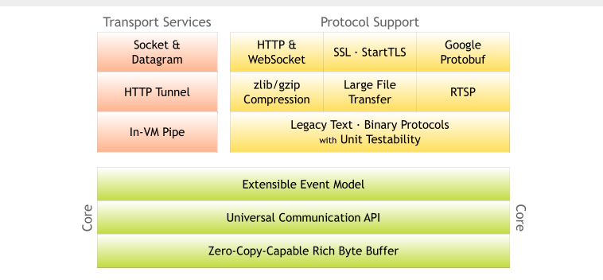

解析：

    &nbsp;&nbsp;&nbsp;&nbsp;1、Core：零拷贝 + API库 + 扩展的事件模型

    &nbsp;&nbsp;&nbsp;&nbsp;2、Protocol Support：支持的协议

    &nbsp;&nbsp;&nbsp;&nbsp;3、Transport Service：支持的传输服务

4、优点

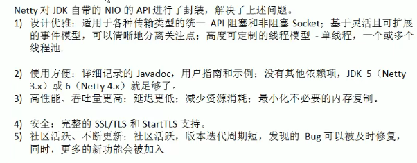

## 13、线程模型介绍(Reactor)

1、目前存在的线程模型：**传统阻塞IO模型、Reactor模型**

2、根据Reactor的数量和处理资源线程池数量不同有3种典型的实现

    &nbsp;&nbsp;&nbsp;&nbsp;1、单Reactor单线程

    &nbsp;&nbsp;&nbsp;&nbsp;2、单Reactor多线程

    &nbsp;&nbsp;&nbsp;&nbsp;3、主从Reactor多线程

**3、Netty线程模式：基于主从Reactor多线程模式进行了一定改进，其中主从Reactor多线程模型有多个Reactor**

4、传统阻塞IO模型


5、Reactor模型

    &nbsp;&nbsp;&nbsp;&nbsp;1、基于IO复用模型：多个连接共用一个阻塞对象，应用程序只需要在一个阻塞对象等待，无需阻塞等待所有连接，当某个连接有新的数据可以处理时，操作系统通知应用程序，线程从阻塞状态返回，开始进行业务处理

    &nbsp;&nbsp;&nbsp;&nbsp;2、基于线程池复用资源：不必再为每个连接创建线程，将连接完成后的业务处理任务分配给线程进行处理，一个线程可以处理多个连接的业务；

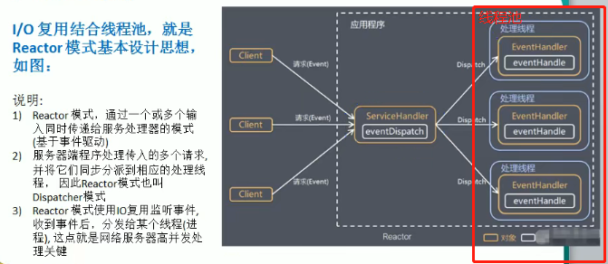

    &nbsp;&nbsp;&nbsp;&nbsp;3、核心组成

    &nbsp;&nbsp;&nbsp;&nbsp;&nbsp;&nbsp;&nbsp;&nbsp;a、Reactor：在一个单独的线程中运行，负责监听和分发事件，分发给适当的处理程序来对IO事件做出反应。就像电话接线员，接听来自客户的电话并将线路转移到适当的联系人；

    &nbsp;&nbsp;&nbsp;&nbsp;&nbsp;&nbsp;&nbsp;&nbsp;b、Handlers：处理程序执行IO事件要完成的实际事件。Reactor通过调度适当的处理程序来相应IO事件，处理程序执行非阻塞操作；

6、三种Reactor实现模型解析

| 类型              | 图解                                     | 说明                                         | 优缺点                                         |
| ----------------- | ---------------------------------------- | -------------------------------------------- | ---------------------------------------------- |
| 单Reactor单线程   |    |    |    |
| 单Reactor多线程   | 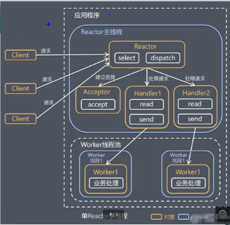   | 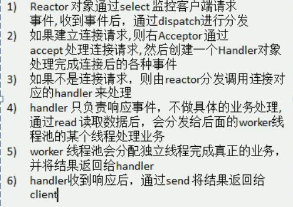   |        |
| 主从Reactor多线程 |  | 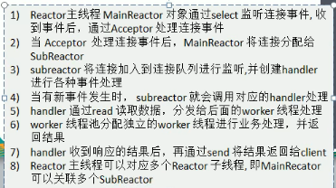 | 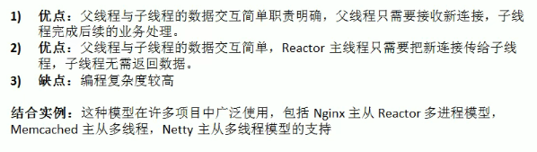 |

## 14、Netty线程模型

1、图解：

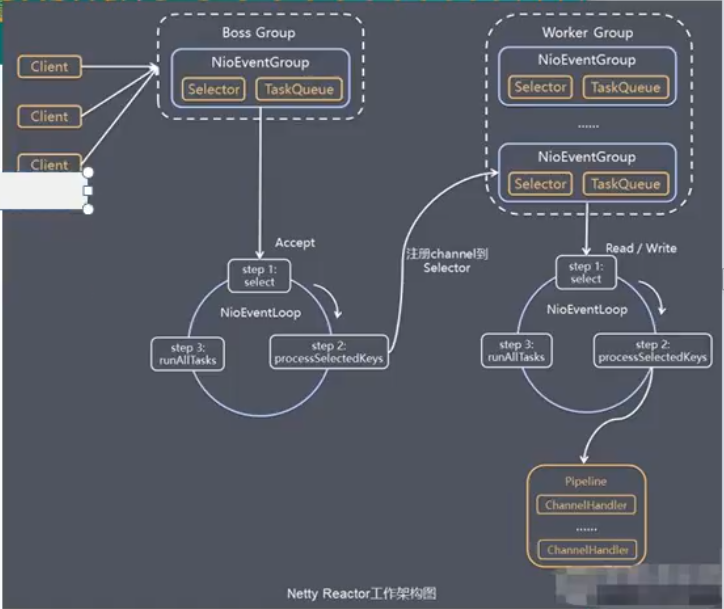

2、说明：

&nbsp;&nbsp;&nbsp;&nbsp;1、Netty抽象出两组线程池BossGroup专门负责接受客户端连接，WorkerGroup专门负责网络的读写；

&nbsp;&nbsp;&nbsp;&nbsp;2、BossGroup和WorkerGroup类型都是NioEventLoopGroup；

&nbsp;&nbsp;&nbsp;&nbsp;3、NioEventLoopGroup相当于一个事件循环组，这个组中含有多个事件循环，每一个事件循环是NioEventLoop；

&nbsp;&nbsp;&nbsp;&nbsp;4、NioEventLoop表示一个不断循环的执行处理任务的线程，每个NioEventLoop都有一个selector，用于监听绑定在其上的socket的网络通讯；

&nbsp;&nbsp;&nbsp;&nbsp;5、NioEventLoopGroup可以有多个线程，即可以含有多个NioEventLoop

&nbsp;&nbsp;&nbsp;&nbsp;6、每个Boss下的NioEventLoop分三步执行

&nbsp;&nbsp;&nbsp;&nbsp;&nbsp;&nbsp;&nbsp;&nbsp;a、轮询accept事件

&nbsp;&nbsp;&nbsp;&nbsp;&nbsp;&nbsp;&nbsp;&nbsp;b、处理accept事件，与client建立连接生成NioSocketChannel，并将其注册到某个worker NIOEventLoop上的selector

&nbsp;&nbsp;&nbsp;&nbsp;&nbsp;&nbsp;&nbsp;&nbsp;c、处理任务队列的任务，即runAllTasks

&nbsp;&nbsp;&nbsp;&nbsp;7、每个Worker下的NioEventLoop循环执行的步骤

&nbsp;&nbsp;&nbsp;&nbsp;&nbsp;&nbsp;&nbsp;&nbsp;a、轮询read、write事件

&nbsp;&nbsp;&nbsp;&nbsp;&nbsp;&nbsp;&nbsp;&nbsp;b、处理io事件，即read、write事件，在对应的NioSocketChannel处理

&nbsp;&nbsp;&nbsp;&nbsp;&nbsp;&nbsp;&nbsp;&nbsp;c、处理任务队列的任务，即runAllTasks

&nbsp;&nbsp;&nbsp;&nbsp;8、Pipeline：每个Worker NioEventLoop处理业务时会使用pipeline(管道)，pipeline中包含了channel，即通过pipeline可以获取到对应channel，管道中维护了很多的处理器；***Netty中的管道为双向链表结构***！

3、补充：

&nbsp;&nbsp;&nbsp;&nbsp;1、netty抽象出两组线程池，BossGroup专门负责接受客户端连接，WorkerGroup专门负责网络读写操作；

&nbsp;&nbsp;&nbsp;&nbsp;2、NioEventLoop表示一个不断循环执行处理任务的线程，每个NioEventLoop都有一个selector用于监听绑定在其上的socket网络通道；

&nbsp;&nbsp;&nbsp;&nbsp;3、NioEventLoop内部采用串行化设计，从消息的读取->解码->编码->发送，始终由IO线程NioEventLoop负责；

&nbsp;&nbsp;&nbsp;&nbsp;&nbsp;&nbsp;&nbsp;&nbsp;NioEventLoopGroup下包含多个NioEventLoop

&nbsp;&nbsp;&nbsp;&nbsp;&nbsp;&nbsp;&nbsp;&nbsp;每个NioEventLoop中包含一个Selector，一个taskQueue

&nbsp;&nbsp;&nbsp;&nbsp;&nbsp;&nbsp;&nbsp;&nbsp;每个NioEventLoop的Selector上可以注册监听多个NioChannel

&nbsp;&nbsp;&nbsp;&nbsp;&nbsp;&nbsp;&nbsp;&nbsp;每个NioEvent只会绑定在唯一的NioEventLoop上

&nbsp;&nbsp;&nbsp;&nbsp;&nbsp;&nbsp;&nbsp;&nbsp;每个NioChannel都绑定有一个自己的ChannelPipeline

## 15、Netty入门案例

构建服务端和客户端消息通信：

服务端：

```java
package com.dwk.netty.demo1;

import io.netty.bootstrap.ServerBootstrap;
import io.netty.buffer.ByteBuf;
import io.netty.buffer.Unpooled;
import io.netty.channel.*;
import io.netty.channel.nio.NioEventLoopGroup;
import io.netty.channel.socket.SocketChannel;
import io.netty.channel.socket.nio.NioServerSocketChannel;
import io.netty.util.CharsetUtil;

public class NettyServerDemo {

    public static void main(String[] args) {
        new NettyServerDemo().nettyServer();
    }

    /**
     * 服务端
     */
    public void nettyServer() {
        /*
        1、创建两个线程组 bossGroup和workerGroup
        2、bossGroup只是处理连接请求  真正和客户端业务处理会交给workerGroup完成
        3、bossGroup 和 workerGroup都是无限循环
         */
        NioEventLoopGroup bossGroup = new NioEventLoopGroup();
        NioEventLoopGroup workerGroup = new NioEventLoopGroup();

        try {
            //创建服务端启动配置
            ServerBootstrap serverBootstrap = new ServerBootstrap();
            serverBootstrap.group(bossGroup, workerGroup) //设置线程组
                    .channel(NioServerSocketChannel.class) //使用NioSocketChannel 作为服务端通道实现
                    .option(ChannelOption.SO_BACKLOG, 128) //设置线程队列得到的连接个数 (设置全连接队列的大小)
                    .childOption(ChannelOption.SO_KEEPALIVE, true) //设置保持活动连接状态
                    .childHandler(new ChannelInitializer<SocketChannel>() { // 创建一个通道测试对象
                        //给pipeline设置处理器
                        @Override
                        protected void initChannel(SocketChannel socketChannel) throws Exception {
                            //具体处理客户端消息的处理器 channelHandlers
                            socketChannel.pipeline().addLast(new NettyServerHandler());
                        }
                    }); //给workerGroup 的EventLoop 对应的管道设置处理器

            System.out.println("服务端初始化完成");

            //绑定端口 并设置同步
            ChannelFuture channelFuture = serverBootstrap.bind(6666).sync();

            //对关闭通道进行监听,涉及到异步模型
            channelFuture.channel().closeFuture().sync();
        } catch (InterruptedException e) {
            throw new RuntimeException(e);
        }finally {
            //关闭线程组  优雅关闭
            bossGroup.shutdownGracefully();
            workerGroup.shutdownGracefully();
        }

    }

    /**
     * 适配器模式
     * 自定义服务端处理器   需要继承netty规定好的适配器
     */
    class NettyServerHandler extends ChannelInboundHandlerAdapter {

        /*
        1、读取数据事件   可以读取客户端发送的消息
        2、ChannelHandlerContext tx ： 上下文对象，含有pipeline管道、通道、地址
        3、Object msg ： 客户端发送的消息
         */
        @Override
        public void channelRead(ChannelHandlerContext ctx, Object msg) throws Exception {
            //将msg转换成byteBuffer
            ByteBuf buf = (ByteBuf) msg;
            System.out.println("服务端接收到客户端" + ctx.channel().remoteAddress()+ "发来的消息：" + buf.toString(CharsetUtil.UTF_8));
            //super.channelRead(ctx, msg);
        }

        /*
        数据读取完毕，返回数据给客户端
         */
        @Override
        public void channelReadComplete(ChannelHandlerContext ctx) throws Exception {
            // 将数据写入到缓冲并刷新,发送的数据需要编码
            ctx.writeAndFlush(Unpooled.copiedBuffer("服务端返回数据",CharsetUtil.UTF_8));
            //super.channelReadComplete(ctx);
        }

        /*
        处理异常(异常处理器)
         */
        @Override
        public void exceptionCaught(ChannelHandlerContext ctx, Throwable cause) throws Exception {
            System.out.println("和" + ctx.channel().remoteAddress() + "通信发生异常");
            ctx.close();
            //super.exceptionCaught(ctx, cause);
        }
    }

}

```

客户端:

```java
package com.dwk.netty.demo1;

import io.netty.bootstrap.Bootstrap;
import io.netty.buffer.ByteBuf;
import io.netty.buffer.Unpooled;
import io.netty.channel.ChannelFuture;
import io.netty.channel.ChannelHandlerContext;
import io.netty.channel.ChannelInboundHandlerAdapter;
import io.netty.channel.ChannelInitializer;
import io.netty.channel.nio.NioEventLoopGroup;
import io.netty.channel.socket.SocketChannel;
import io.netty.channel.socket.nio.NioSocketChannel;
import io.netty.util.CharsetUtil;

public class NettyClientDemo {

    public static void main(String[] args) {
        new NettyClientDemo().nettyClient();
    }

    /**
     * 客户端
     */
    public void nettyClient(){
        // 客户端需要一个事件循环组
        NioEventLoopGroup eventExecutors = new NioEventLoopGroup();
        try {
            //创建启动配置
            Bootstrap bootstrap = new Bootstrap();
            bootstrap.group(eventExecutors) //设置线程组
                    .channel(NioSocketChannel.class) //设置客户端通道的实现类
                    .handler(new ChannelInitializer<SocketChannel>() {
                        //设置客户端处理器
                        @Override
                        protected void initChannel(SocketChannel socketChannel) throws Exception {
                            socketChannel.pipeline().addLast(new NettyClientHandler());
                        }
                    });
            System.out.println("客户端初始化完成");
            //启动客户端连接服务端 并设置同步
            ChannelFuture channelFuture = bootstrap.connect("127.0.0.1", 6666).sync();
            //给关闭通道进行监听
            channelFuture.channel().closeFuture().sync();
        } catch (InterruptedException e) {
            throw new RuntimeException(e);
        }finally {
            eventExecutors.shutdownGracefully();
        }
    }

    /**
     * 自定义客户端处理器
     */
    class NettyClientHandler extends ChannelInboundHandlerAdapter {

        //当通道就绪就会触发该方法
        @Override
        public void channelActive(ChannelHandlerContext ctx) throws Exception {
            //给服务器发送消息
            ctx.writeAndFlush(Unpooled.copiedBuffer("我是客户端", CharsetUtil.UTF_8));
            super.channelActive(ctx);
        }

        //当通道有读取事件时会触发该方法
        @Override
        public void channelRead(ChannelHandlerContext ctx, Object msg) throws Exception {
            ByteBuf buf = (ByteBuf) msg;
            System.out.println("客户端接受到服务端的消息:" + buf.toString(CharsetUtil.UTF_8));
            //super.channelRead(ctx, msg);
        }

        //异常处理器
        @Override
        public void exceptionCaught(ChannelHandlerContext ctx, Throwable cause) throws Exception {
            cause.printStackTrace();
            super.exceptionCaught(ctx, cause);
        }
    }

}


```

运行结果:

| 服务端                                                    | 客户端                                                    |
| --------------------------------------------------------- | --------------------------------------------------------- |
|  | 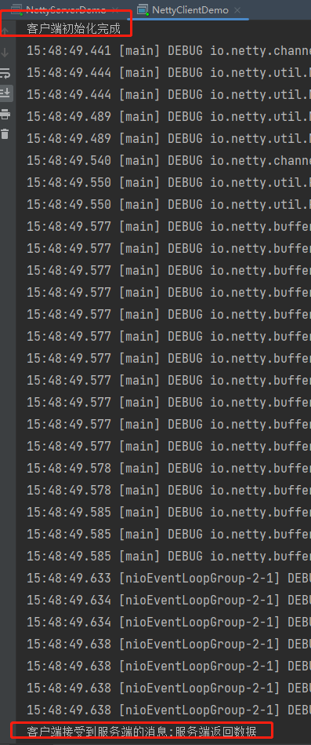 |

## 16、taskQueue任务队列

1、任务队列中的Task有三种典型使用场景

&nbsp;&nbsp;&nbsp;&nbsp;1、用户程序自定义的普通任务

&nbsp;&nbsp;&nbsp;&nbsp;2、用户自定义定时任务

&nbsp;&nbsp;&nbsp;&nbsp;3、非当前Reactor线程调用Channel的各种方法；

2、将耗时的业务逻辑放至任务队列进行异步处理，减少服务端和客户端间通信的耗时；

## 17、异步模型

1、异步的概念和同步相反；当一个异步过程调用发出后，调用者不能立刻得到结果，实际处理这个调用的组件在完成后通过状态、通知和回调来通知调用者；

2、netty中的IO操作是异步的，包括Bind、Write、Connect等操作会简单的返回一个ChannelFuture；

3、调用者并不能立刻获得结果，而是通过Future-Listener机(任务监听)机制，用户可以方便的主动获取或者通过通知机制获得IO操作结果；

4、netty的异步模型是建立在future和callback之上的；callback就是回调，重点说Future，它的核心思想是：假设一个方法run，计算过程可能非常耗时，等待fun返回显然不合适。那么可以在调用fun的时候立马返回一个Future，后续可以通过Future去监控方法的处理过程 即 Future-Listener机制；

5、Future：表示异步的执行结果可以通过它提供的方法来检测执行是否完成，比如检索计算等；

6、ChannelFuture是一个接口，可以添加监听器，当监听的事件发生时就会通知到监听器；

7、工作原理：

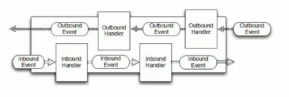

在使用Netty进行编程时，拦截操作和转换出入站数据只需要提供callback或利用future即可，这使得链式操作简单、高效并有利于编写可重用的通用的代码；

Netty框架的目标就是让业务逻辑从网络基础应用编码中分离出来；

8、当Future对象刚刚创建时处于非完成状态，调用者可以通过返回的ChannelFuture来获取操作执行的状态，注册监听函数来执行完成后的操作；常见有如下操作：

&nbsp;&nbsp;&nbsp;&nbsp;1、通过isDone方法来判断当前操作是否完成；

&nbsp;&nbsp;&nbsp;&nbsp;2、通过isSuccess方法来判断已完成的当前操作是否成功；

&nbsp;&nbsp;&nbsp;&nbsp;3、通过getCause方法来获取已完成的当前操作失败的原因；

&nbsp;&nbsp;&nbsp;&nbsp;4、通过isCancelled方法来判断已完成的当前操作是否被取消；

&nbsp;&nbsp;&nbsp;&nbsp;5、通过addListener方法来注册监听器，当操作已完成(isDone方法返回完成)，将会通知指定的监听器；如果Future对象已完成，则通知指定的监听器；

9、代码示例 (给bind()绑定端口方法添加监视器)：

```java
 	    //绑定端口 并设置同步
            ChannelFuture channelFuture = serverBootstrap.bind(6666).sync();

            //给bind方法添加监听器
            channelFuture.addListener(new ChannelFutureListener() {
                @Override
                public void operationComplete(ChannelFuture channelFuture) throws Exception {
                    if (channelFuture.isSuccess()){
                        System.out.println("监听端口成功");
                    }else{
                        System.out.println("监听端口失败");
                    }
                }
            });

```

*优点：相比传统阻塞IO ，执行IO操作后线程会被阻塞住，直到操作完成；异步处理的好处是不会造成线程阻塞，线程在IO操作期间可以执行别的程序，在高并发情形下会更稳定和更高的吞吐量；*

## 18、使用Netty开发HTTP服务案例

demo代码：

```java
package com.dwk.netty.demo2.service;

import io.netty.bootstrap.ServerBootstrap;
import io.netty.buffer.ByteBuf;
import io.netty.buffer.Unpooled;
import io.netty.channel.*;
import io.netty.channel.nio.NioEventLoopGroup;
import io.netty.channel.socket.SocketChannel;
import io.netty.channel.socket.nio.NioServerSocketChannel;
import io.netty.handler.codec.http.*;
import io.netty.util.CharsetUtil;

public class NettyHttpServiceImp {

    public static void main(String[] args) {
        new NettyHttpServiceImp().server();
    }

    public void server(){
        EventLoopGroup bossGroup = new NioEventLoopGroup();
        EventLoopGroup workerGroup = new NioEventLoopGroup();

        try{
            //服务端启动配置
            ServerBootstrap serverBootstrap = new ServerBootstrap();
            serverBootstrap.group(bossGroup,workerGroup)
                    .channel(NioServerSocketChannel.class)
                    .childHandler(new ServerInitializer());
            //绑定端口启动服务
            ChannelFuture channelFuture = serverBootstrap.bind(6666).sync();

            //添加bind监听器
            channelFuture.addListener(new ChannelFutureListener() {
                @Override
                public void operationComplete(ChannelFuture channelFuture) throws Exception {
                    if (channelFuture.isSuccess()){
                        System.out.println("服务端启动成功");
                    }else{
                        System.out.println("服务端启动失败");
                    }
                }
            });

            //监听关闭端口
            channelFuture.channel().closeFuture().sync();

        }catch (Exception e){
            e.printStackTrace();
        }finally {
            bossGroup.shutdownGracefully();
            workerGroup.shutdownGracefully();
        }

    }

}

/**
 * 服务端初始化器  处理pipeline
 */
class ServerInitializer extends ChannelInitializer<SocketChannel> {

    @Override
    protected void initChannel(SocketChannel socketChannel) throws Exception {
        //获取管道
        ChannelPipeline pipeline = socketChannel.pipeline();
        //添加解码器   HttpServerCodec-netty提供的Http编解码器
        pipeline.addLast("MyHttpServerCodec",new HttpServerCodec());
        //添加自定义处理器
        pipeline.addLast("MyServerHandler",new ServerHandler());
    }
}

/**
 * 服务端自定义处理器
 * SimpleChannelInboundHandler extends ChannelInboundHandlerAdapter
 * HttpObject : 客户端和服务端相互通讯的数据被封装成 HttpObject
 */
class ServerHandler extends SimpleChannelInboundHandler<HttpObject>{

    @Override
    protected void channelRead0(ChannelHandlerContext channelHandlerContext, HttpObject msg) throws Exception {
        //判断消息类型
        if (msg instanceof HttpRequest){
            System.out.println("开始处理Http请求...");
            // 回复信息给浏览器 回复的消息要符合Http协议
            ByteBuf content = Unpooled.copiedBuffer("我是服务器返回的消息", CharsetUtil.UTF_8);
            //构建http响应
            DefaultFullHttpResponse defaultFullHttpResponse = new DefaultFullHttpResponse(HttpVersion.HTTP_1_1, HttpResponseStatus.OK, content);
            defaultFullHttpResponse.headers().set(HttpHeaderNames.CONTENT_TYPE,"application/json");
            defaultFullHttpResponse.headers().set(HttpHeaderNames.CONTENT_LENGTH,content.readableBytes());
            //将构建好的response返回
            channelHandlerContext.writeAndFlush(defaultFullHttpResponse);
        }
    }
}

```

运行结果：


## 19、Netty核心模块

1、Bootstrap和ServerBootstrap

&nbsp;&nbsp;&nbsp;&nbsp;1、Bootstrap意思是引导，一个Netty应用通常由一个Bootstrap开始，主要作用是配置整个Netty程序，串联各个组件，Netty中Bootstrap类是客户端程序的启动引导类，ServerBootstrap是服务端启动引导类；相当于是启动配置；

&nbsp;&nbsp;&nbsp;&nbsp;2、常见方法：

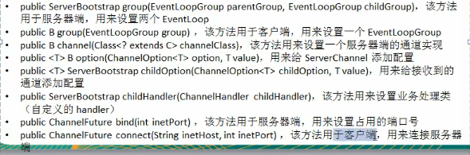

2、Future和ChannelFuture

&nbsp;&nbsp;&nbsp;&nbsp;1、Netty中所有的IO操作都是异步的，不能立刻得知消息是否被正确处理。但是也可以过一会等它执行完成或者直接注册一个监听器，具体实现就是通过Future和ChannelFuture 他们可以注册一个监听，当操作执行成功或者失败时监听会自动触发注册的监听事件。

&nbsp;&nbsp;&nbsp;&nbsp;2、常见方法：
Channel channel() : 返回当前正在进行IO操作的通道；

ChannelFuture sync() : 等待异步操作执行完毕；

3、Channel

&nbsp;&nbsp;&nbsp;&nbsp;1、Netty网络通信的组件，能够用于执行网络IO操作；

&nbsp;&nbsp;&nbsp;&nbsp;2、通过Channel可获得当前网络连接的通道状态

&nbsp;&nbsp;&nbsp;&nbsp;3、通过Channel可获得网络连接的配置参数(例如接受缓冲区大小)

&nbsp;&nbsp;&nbsp;&nbsp;4、Channel提供异步的网络IO操作(如建立连接、读写、绑定端口)，异步调用意味着任何IO调用都将立即返回但是不保证在调用结束时所请求的IO操作已完成

&nbsp;&nbsp;&nbsp;&nbsp;5、调用立即返回一个ChannelFuture实例，通过注册监听器到ChannelFuture上可以将IO操作成功、失败或者取消时的回调通知到客户端；

&nbsp;&nbsp;&nbsp;&nbsp;6、支持关联IO操作与对应的处理程序；

&nbsp;&nbsp;&nbsp;&nbsp;7、不同协议、不同的阻塞类型的连接都有不同的Channel类型与之对应，常用的Channel类型：


4、Selector

&nbsp;&nbsp;&nbsp;&nbsp;1、Netty基于Selector对象实现***IO多路复用***，通过Selector一个线程可以监听多个连接的Channel事件；

&nbsp;&nbsp;&nbsp;&nbsp;2、当向一个Selector中注册Channel后，Selector内部的机制就可以自动不断的查询（循环）这些注册的Channel中是否有已就绪的IO事件（可读、可写、网络连接完成等），这样程序就可以很简单地使用一个线程高效管理多个Channel；

5、ChannelHandler

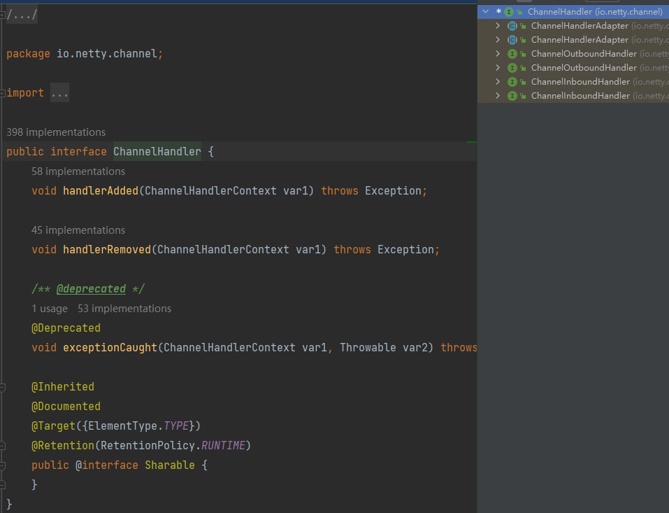

处理IO事件或者拦截IO操作，并将其转发到其ChannelPipeline(业务处理链)中的下一个处理程序；
